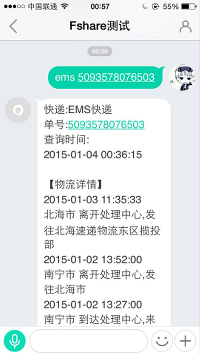
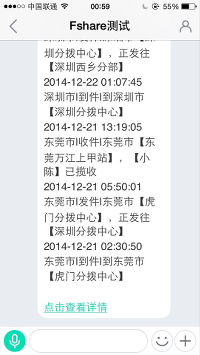
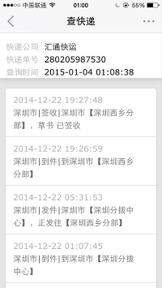

易信 / 微信 公众平台_查快递
======

使用方法,编辑以下内容发送至公众平台即可:   
如（查询EMS单号为```1034616494006```的快递
```ems 1034616494006``` 

只做一个快递公司，后期会添加快递100API没有的一些快递。   
比如易客满(美国亚马逊海淘至中国使用的快递) 

### 演示请关注易信: fshare 
     


### 可删除的文件 ###
- add_companies.php   后期需要扩展的其它快递公司文件
- company_dat.php     将dat的sqlite格式的快递数据提取出来(已完成)
- data.dat            快递公司数据，Sqlite格式

注：此快递查询是建立在之前的快递查询的基础之上的。   

=============
作者QQ：1005043848
易信/ 微信: Skiychan   
OPCMS交流群:20625469   
E－mail:  developer@zzzzy.com   
支持网站: <http://www.skiy.net> 
